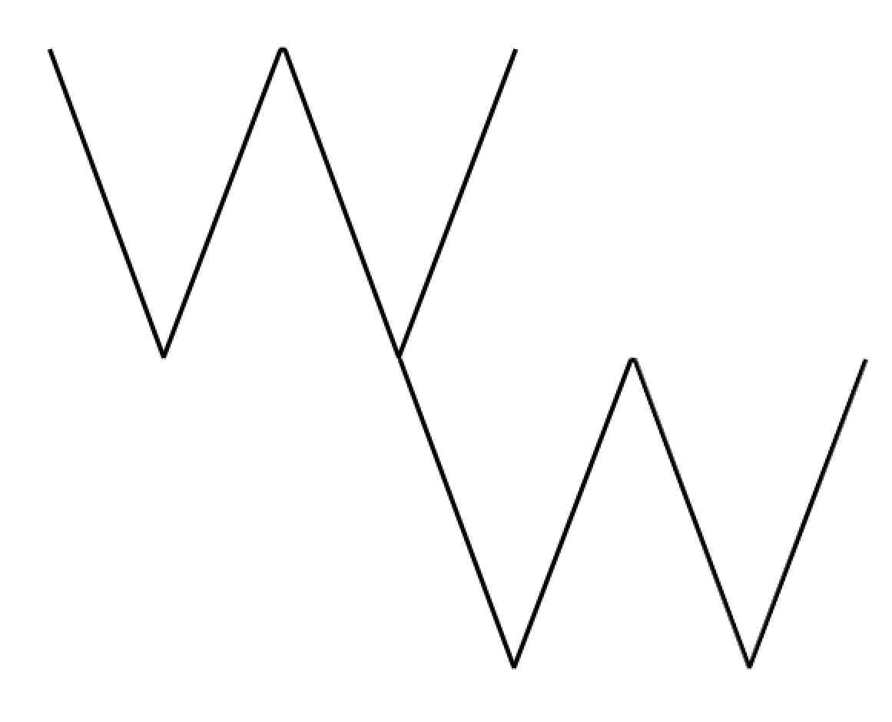

# Game Studio Brainstorming Template

## Studio Name Ideas
- **Primary Ideas:**
  - Rampage Stoftware
  - HopeLock Studios
  - WiczWare Games
- **Alternative Ideas:**
  - N/A, 3rd ones the charm apparently

- **Chosen Name**: WiczWare Games
- **About the name**: Used the end of my last name (juchnieWICZ) for the name
- **Social Medias with name available**: Instagram, Reddit, Twitter(X), Facebook, Twitch, Youtube
- **Possible domain names available**: .com, .net, .org, .co, basically any one i want

---

## Vision Statement

> To bring games to the masses that will bring the masses to games

---

## Core Values

- Optimization: Many game studios have forgone optimizing their games as a cost cutting measure, leading to resource-demanding, sloppy games. I aim to forerun a new era of game development, where hardware is utilized to its fullest potential
- Affordability: Games nowadays are getting more expensive, while arguably getting worse. As a solo game studio, I strive to bring quality games to the masses while ensuring the masses can still afford them.
- Excellence: As a solo game studio, I strive for excelence in everything I make and everything I do, and that doesn't stop at the door

---

## Target Audience

- **Demographic:** TTRPG players, board game enthousiasts, casual players
- **Interests:** Multiplayer, Teamwork, 
- **Platforms:** PC, Tabletop

---

## Genre Focus

> Dungeon Crawler

---

## Unique Selling Point (USP)

> Difficulty adjustment for different skill-level play groups

---

## Tools and Technology

- **Game Engine(s):** Unity for digital prototyping
- **Art Tools:** GIMP (bitmap drawing), Inkscape (vector drawing), Dextrous (card design tool)
- **Audio Tools:** Audacity (soundtrack), reaper daw (soundtrack), bfxr (sound effects)
- **Version Control:** Github for tracking developments 
- **Publishing Platforms:** Steam, Github Pages for prototyping, Itch.io

---

## Branding and Aesthetics

- **Logo Style:** as if drawn in gunpowder, and the beginning of the first W is ignited
- **Tagline Ideas:** 
  - Bringing the masses to games

-- **Sketches/Logo**:

- something in this shape, i just cant draw, may update with actual logo later

---

## Additional Notes

> N/a